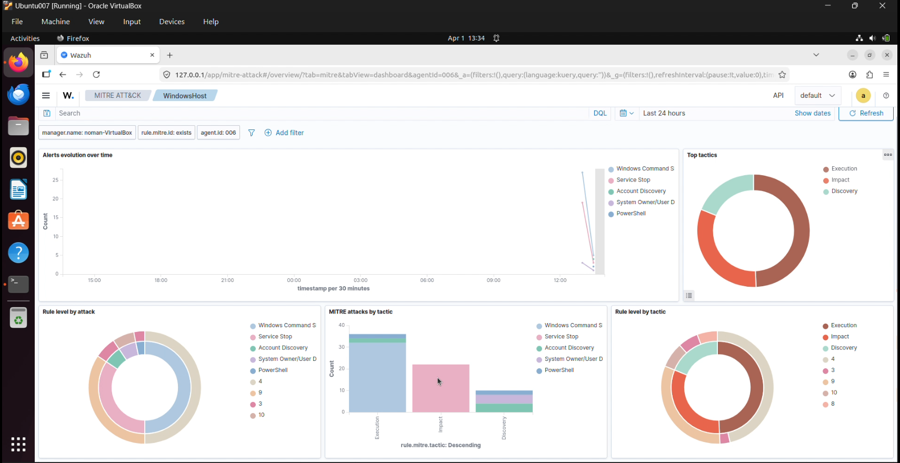
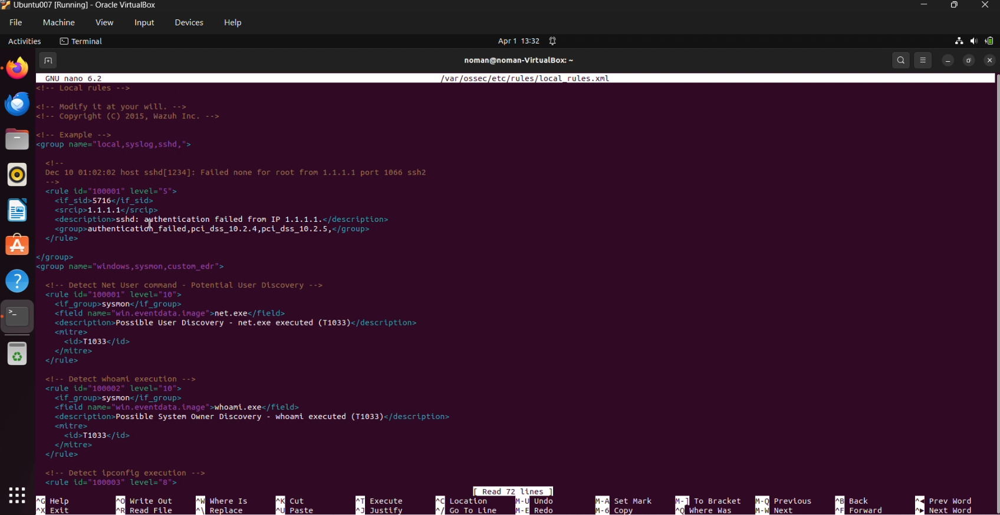
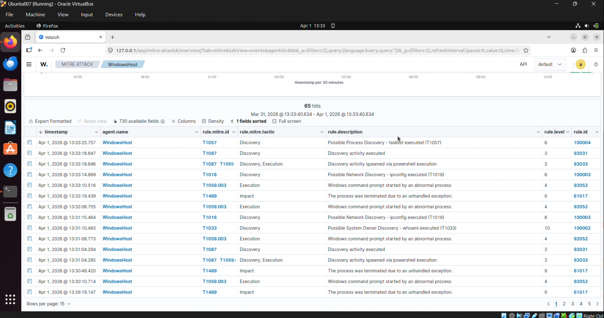

# 🔍 Wazuh EDR with Sysmon & MITRE ATT&CK Threat Detection





---

## 📌 Project Overview

This project demonstrates deploying **Wazuh as an EDR solution** on a Windows 11 endpoint using Sysmon for deep telemetry. Custom detection rules were written and mapped to **MITRE ATT&CK** techniques. Real attack reconnaissance techniques were simulated and detected in real time.

---

## 🏗️ Lab Architecture

```
┌──────────────────────────────────────────────────┐
│              Windows 11 Endpoint                 │
│                                                  │
│  ┌────────────────────────────────────────────┐  │
│  │  Sysmon v15.20                             │  │
│  │  (SwiftOnSecurity Config)                  │  │
│  │  ↓ Process, Network, Registry Events       │  │
│  │  Wazuh Agent                               │  │
│  │  ↓ Forwards to Manager                     │  │
│  └────────────────────────────────────────────┘  │
│                    ↓ Port 1514/TCP               │
│  ┌────────────────────────────────────────────┐  │
│  │  Ubuntu VM — Wazuh Manager                 │  │
│  │  Custom Detection Rules                    │  │
│  │  OpenSearch + Dashboard                    │  │
│  │  MITRE ATT&CK Mapping                      │  │
│  └────────────────────────────────────────────┘  │
└──────────────────────────────────────────────────┘
```

---

## 🛠️ Tools & Technologies

| Tool | Purpose |
|---|---|
| Sysmon v15.20 | Deep endpoint telemetry |
| SwiftOnSecurity Config | Industry-standard Sysmon configuration |
| Wazuh Agent | Log collection and forwarding |
| Wazuh Manager | Detection rule engine |
| Custom Wazuh Rules | MITRE ATT&CK mapped detections |
| MITRE ATT&CK Framework | Threat classification and mapping |

---

## 🎯 MITRE ATT&CK Techniques Detected

| Technique ID | Technique Name | Simulated By | Rule ID |
|---|---|---|---|
| T1033 | System Owner/User Discovery | `whoami`, `net user` | 100002 |
| T1057 | Process Discovery | `tasklist` | 100004 |
| T1082 | System Information Discovery | `systeminfo` | 100005 |
| T1016 | Network Configuration Discovery | `ipconfig /all` | 100003 |
| T1049 | System Network Connections Discovery | `netstat -an` | 100001 |

---

## 📝 Custom Detection Rules

```xml
<group name="windows,sysmon,custom_edr">

  <!-- T1049 - Network Connections Discovery -->
  <rule id="100001" level="10">
    <if_group>sysmon</if_group>
    <field name="win.eventdata.image">net.exe</field>
    <description>Possible User Discovery - net.exe executed (T1033)</description>
    <mitre>
      <id>T1033</id>
    </mitre>
  </rule>

  <!-- T1033 - System Owner/User Discovery -->
  <rule id="100002" level="10">
    <if_group>sysmon</if_group>
    <field name="win.eventdata.image">whoami.exe</field>
    <description>Possible System Owner Discovery - whoami executed (T1033)</description>
    <mitre>
      <id>T1033</id>
    </mitre>
  </rule>

  <!-- T1016 - Network Configuration Discovery -->
  <rule id="100003" level="8">
    <if_group>sysmon</if_group>
    <field name="win.eventdata.image">ipconfig.exe</field>
    <description>Possible Network Discovery - ipconfig executed (T1016)</description>
    <mitre>
      <id>T1016</id>
    </mitre>
  </rule>

  <!-- T1057 - Process Discovery -->
  <rule id="100004" level="8">
    <if_group>sysmon</if_group>
    <field name="win.eventdata.image">tasklist.exe</field>
    <description>Possible Process Discovery - tasklist executed (T1057)</description>
    <mitre>
      <id>T1057</id>
    </mitre>
  </rule>

  <!-- T1082 - System Information Discovery -->
  <rule id="100005" level="10">
    <if_group>sysmon</if_group>
    <field name="win.eventdata.image">systeminfo.exe</field>
    <description>Possible System Info Discovery - systeminfo executed (T1082)</description>
    <mitre>
      <id>T1082</id>
    </mitre>
  </rule>

</group>
```

---

## 🔥 Attack Simulation Commands Used

```powershell
# T1033 - User Discovery
whoami /all
net user
net localgroup administrators

# T1082 - System Info Discovery
systeminfo

# T1057 - Process Discovery
tasklist /v

# T1016 - Network Discovery
ipconfig /all
arp -a

# T1049 - Network Connections
netstat -an

# T1053 - Scheduled Tasks
schtasks /query /fo LIST
```

---

## 📸 Screenshots

### MITRE ATT&CK Dashboard


### Custom Rules Firing


### Alert Detail View


---

## 📂 Repository Structure

```
Wazuh-EDR-Sysmon-MITRE/
├── README.md
├── screenshots/
│   ├── mitre-attack-dashboard.png
│   ├── custom-rules-alerts.png
│   ├── sysmon-events.png
│   └── alert-detail.png
└── configs/
    ├── local_rules.xml       ← Custom detection rules
    ├── ossec.conf            ← Agent configuration with Sysmon
    └── sysmon-config.xml     ← SwiftOnSecurity Sysmon config
```

---

## 🎯 Key Takeaways

- Hands-on experience configuring an EDR solution from scratch
- Deep understanding of Sysmon telemetry and Windows event log analysis
- Practical experience writing custom SIEM detection rules
- MITRE ATT&CK framework applied to real detection engineering
- Foundation for threat hunting and incident response in MSSP environments

---

## 🔗 Related Projects

- [Project 1 — Wazuh SIEM Deployment](https://github.com/qadirbux007/SOC-Home-Lab-Wazuh)
- [Project 3 — ELK Stack Log Analysis](https://github.com/qadirbux007/ELK-Stack-Log-Analysis)
- [Project 4 — Snort IDS Detection](https://github.com/qadirbux007/Snort-IDS-Detection)

---

*Part of my SOC Portfolio Series — building hands-on experience for MSSP roles.*
